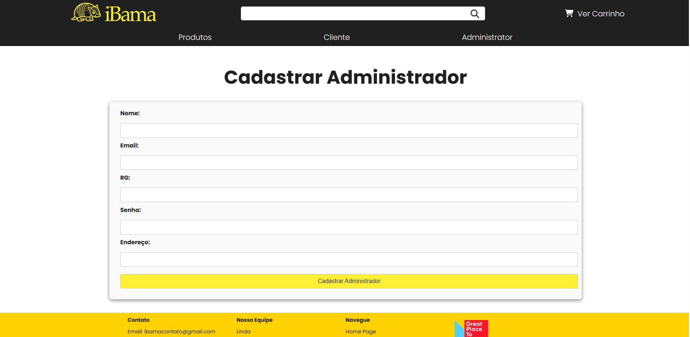

# ProjetoWeb
Projeto desenvolvido para a disciplina SCC0219

## Integrantes
<b>
* Lucas Pereira Pacheco NºUSP: 12543930  
* Pedro Afonso Perez Chagas NºUSP: 7777970  
* Ramon Moreira Machado NºUSP: 12543179  
</b>

 

Tabelas de conteúdo 
 1. [Requisitos](#requisitos)
 2. [Descrição do Projeto](#descricao)
 3. [Comentários sobre o Código](#comentarioscodigo)
 4. [Plano de testes](#testes)
 5. [Resultados dos testes](#testesresultados)
 6. [Como faço para rodar o projeto?](#how)
 7. [Problemas](#problemas)
 7. [Comentários](#problemas)

  

## Requisitos
Nossos requsitos não fogem de nada especificado no documento do trabalho. Nossa implementação foi feita inteiramente como especificado.

  

## Descrição do Projeto

### Sobre a entrega Atual

Nosso projeto consiste em um petshop, o iBama, contamos com diversos produtos para seus pets.

O sistema foi pensado tanto para o usuário cliente, que pode navegar com facilidade no site e encontrar facilmente o que deseja comprar, tanto para o administrador que vai gerenciar os produtos do site e fazer seu trabalho com facilidade!

Salientamos que nosso site foi feito utilizando REACT como aprendido em aula, inclusive com uma implementação responsiva para se ajustar a qualquer tamanho de tela e garantir uma melhor experiência do usuário.

Ao longo desse README, iremos mostrar diagramas e capturas de tela do sistema para facilitar a compreensão de nosso trabalho.

### Futuras entregas
Nosso sistema se tornará uma plataforma de e-commerce robusta e funcional. Os clientes poderão desfrutar de uma experiência de compra completa, começando pelo cadastro fácil e rápido. Eles terão a liberdade de atualizar suas informações pessoais conforme necessário e aproveitarão recursos de filtragem para encontrar os produtos desejados de forma mais eficiente. Além disso, poderão adicionar os produtos ao carrinho de compras e finalizar a compra de maneira conveniente.

Por outro lado, os administradores terão acesso a recursos exclusivos para gerenciar e expandir o catálogo de produtos. Eles poderão criar suas contas de administrador, modificar suas informações quando necessário e serão responsáveis por cadastrar novos produtos no sistema. Além disso, terão a capacidade de realizar alterações nos cadastros existentes, garantindo que as informações sejam sempre atualizadas e precisas.

Com essas funcionalidades abrangentes, nosso sistema promete oferecer uma experiência de compra agradável para os clientes e, ao mesmo tempo, fornecer às equipes administrativas todas as ferramentas necessárias para gerenciar efetivamente o processo de vendas e o catálogo de produtos.

#### Funcionalidades para os clientes:
* Se cadastrar;
* Alterar seus dados;
* Filtrar os produtos que quiser;
* Colocá-los no carrinho;
* Finalizar compra.

#### Funcionalidades para os administradores:

* Se cadastrar;
* Alterar seus dados;
* Cadastrar novos produtos;
* Alterar o cadastro de produtos;

obs.: Se verificarmos a necessidade de mais alguma funcionalidade, nós a adicionaremos.

#### Informações salvas no servidor

As informações salvas no servidor serão as providas pelos clientes e admins quando realizarem seu cadastro, as informações dos produtos cadastrados pelos administradores, das mudanças nos dados do administrador ou do cliente (quando for realizada alguma alteração) e das transações de compra do cliente.

Nas próximas entregas detalharemos cada um dos campos que serão necessários.

#### Diagrama de Navegação

Algumas das paginas são:

* **Home:**

* **Login**
Tela de login para cliente

Tela de login para administrador

* **Registrar**
Tela de registro para cliente

Tela de registro para Administrador

Tela de procurar produtos

Tela do administrador

Tela do carrinho

Entre várias outras!

 

## Comentários sobre o código
Foram desenvolvidas os "componentes" e as "pages"

## Testes
Nosso sistema conta com alguns testes realizados com json, verificando a integridade desses arquivos e também algumas funcionalidade, como, por exemplo, a funcionalidade especial de recomendação.

Para rodá-los, utilize:

``npm install --save-dev jest``

e depois execute com

``npm test``

## Resultados dos testes

 

## Como faço para rodar o projeto?

Para instalar os pacotes necessários, entre na pasta "projeto" e utilize:

``npm install``

e depois execute com

``npm run dev``

Qualquer dúvida ou problema por favor não deixe de nos contactar por telegram!

@lusca.cpp
@pedropp98
@ramoo_n

 

## Problemas

## Comentários

 

